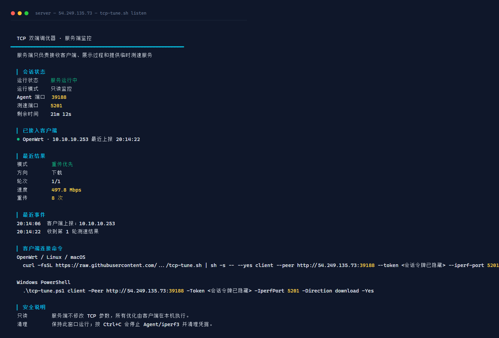
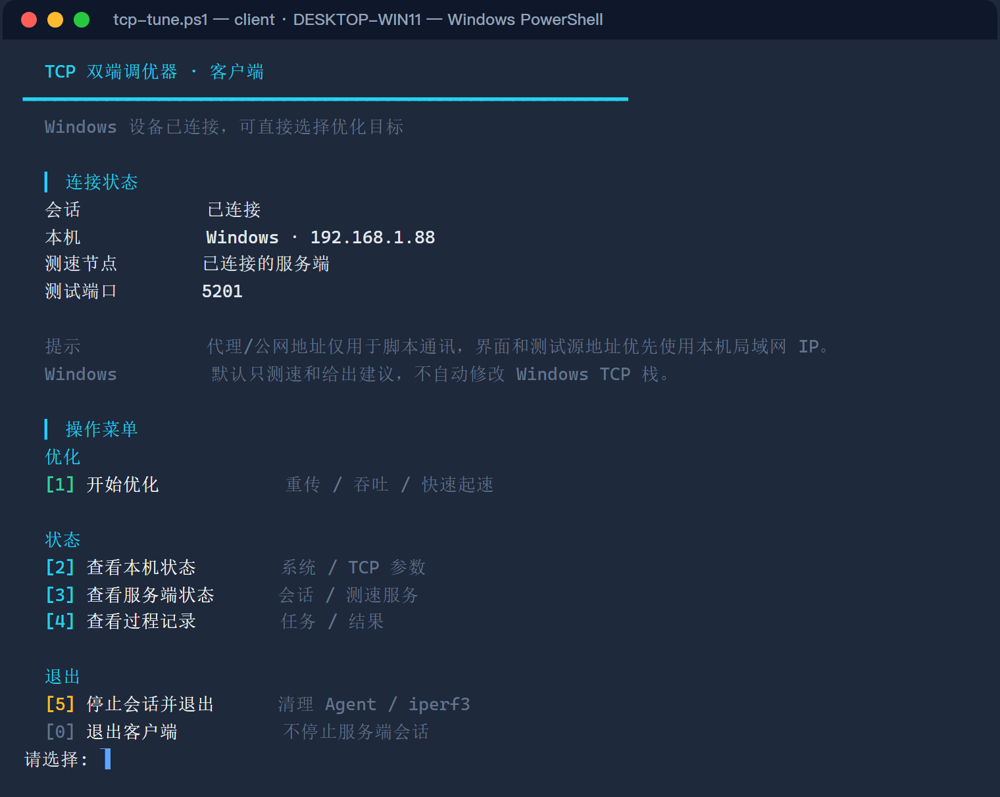

# TCP-optimization

TCP-optimization 是一个双端 TCP 调优脚本，用来在 VPS 和客户端之间做真实测速、自动调参和安全回滚。

它的目标很简单：

- 服务端只负责监听、测速和展示状态。
- 客户端负责本机优化，例如 OpenWrt、Linux、macOS、Windows。
- OpenWrt 不强制安装 Python，AI 功能可通过 curl 调用公共 AI 网关。
- 所有修改都有备份，退出时会清理临时 Agent 和 iperf3。

<table>
  <tr>
    <td width="50%" align="center">
      <strong>服务端监控</strong><br>
      
    </td>
    <td width="50%" align="center">
      <strong>客户端面板</strong><br>
      
    </td>
  </tr>
</table>

## 特性

- 双端通讯：服务端启动后给出客户端连接命令。
- 自动依赖：自动检测并安装 iperf3、curl、python3 等必要依赖。
- 基础加速：客户端/调参路径默认启用 BBR 与 FQ/fq_codel。
- 三种确定性优化：重传优先、吞吐优先、快速起速。
- AI 智能调参：AI 只返回结构化建议，脚本按白名单和数值边界执行。
- OpenWrt 轻量支持：OpenWrt 端不要求 python3。
- 安全清理：Ctrl+C 或菜单停止会清理本工具创建的 Agent/iperf3。
- 回滚备份：每次写入参数前都会保存备份。

## 快速开始

### 1. 服务端运行

在 VPS 上运行：

```sh
curl -fsSL https://raw.githubusercontent.com/10000ge10000/TCP-optimization/main/tcp-tune.sh | sudo sh -s -- --yes server
```

服务端启动后会显示 OpenWrt/Linux/macOS/Windows 客户端命令。

### 2. 客户端运行

复制服务端输出的客户端命令，在 OpenWrt 或本机运行即可。

已有脚本时也可以这样运行：

```sh
sh tcp-tune.sh --yes client --peer http://SERVER:39188 --token TOKEN --iperf-port 5201
```

Windows PowerShell：

```powershell
iwr -UseBasicParsing https://raw.githubusercontent.com/10000ge10000/TCP-optimization/main/tcp-tune.ps1 -OutFile tcp-tune.ps1
.\tcp-tune.ps1 client -Peer http://SERVER:39188 -Token TOKEN -IperfPort 5201 -Direction download -Yes
```

Windows 无 winget/choco/scoop 时，脚本会把 iperf3 下载到用户缓存目录，不写系统目录。

## 客户端菜单

```text
[1] 开始优化          确定性调参：重传 / 吞吐 / 快速起速
[2] AI 智能调参       AI 辅助：快速起速 / 吞吐 / 重传
[3] 查看本机状态      系统 / TCP 参数
[4] 查看服务端状态    会话 / 测速服务
[5] 查看过程记录      任务 / 结果
[6] 停止会话并退出    清理 Agent / iperf3
[0] 退出客户端        不停止服务端会话
```

## 优化模式

| 模式 | 适合场景 | 目标 |
|---|---|---|
| 重传优先 | 游戏、语音、远程桌面 | 尽量压低重传 |
| 吞吐优先 | 下载、备份、大文件 | 提升稳定传输速度 |
| 快速起速 | 网页、小文件、短连接 | 缩短连接初期提速时间 |

AI 智能调参里的默认模式也是“快速起速”，不是均衡模式。

## OpenWrt 会被修改什么

OpenWrt 端只会做 TCP 相关的最小修改，常见写入位置：

```text
/etc/sysctl.d/99-tcp-tune.conf
/etc/sysctl.d/97-tcp-tune-baseline.conf
/etc/sysctl.d/zz-tcp-ipv6-local-peer.conf
```

可能修改的参数包括：

```text
net.ipv4.tcp_mtu_probing
net.ipv4.tcp_congestion_control
net.ipv4.tcp_slow_start_after_idle
net.ipv4.tcp_notsent_lowat
net.ipv4.tcp_limit_output_bytes
net.core.default_qdisc
net.core.rmem_max
net.core.wmem_max
net.ipv4.tcp_rmem
net.ipv4.tcp_wmem
```

不会自动修改：

```text
防火墙 / WAN / LAN / DNS / DHCP / PPPoE / 代理服务 / OpenClash / Mihomo / Nikki
```

## AI 调参

命令行入口：

```sh
sh tcp-tune.sh AI测速
sudo sh tcp-tune.sh AI自动优化 --对端 2406:xxxx:xxxx::1 --目标 startup --轮数 3
sh tcp-tune.sh AI诊断 --摘要 SUMMARY.json
```

AI 不能执行任意命令，只能返回 JSON。脚本会校验字段白名单和数值上下限后再写入。

普通用户默认使用项目提供的 AI 网关，不需要自己配置 API Key。
默认模型为 `gpt-5.5`，网关由项目方统一转发到 sub2api；可通过 `NVIDIA_MODEL` 覆盖请求模型名。

## 回滚

最近一次修改可以回滚：

```sh
sudo sh tcp-tune.sh rollback
```

备份目录通常在：

```text
/var/lib/tcp-tune/backups
/var/lib/tcp-tune/manual-*
```

## 清理

停止临时 Agent 和 iperf3：

```sh
sudo sh tcp-tune.sh stop-agent
```

本工具只停止自己记录 pid 的临时进程，不会主动杀掉用户已有的长期 iperf3 服务。

## 许可证

MIT
